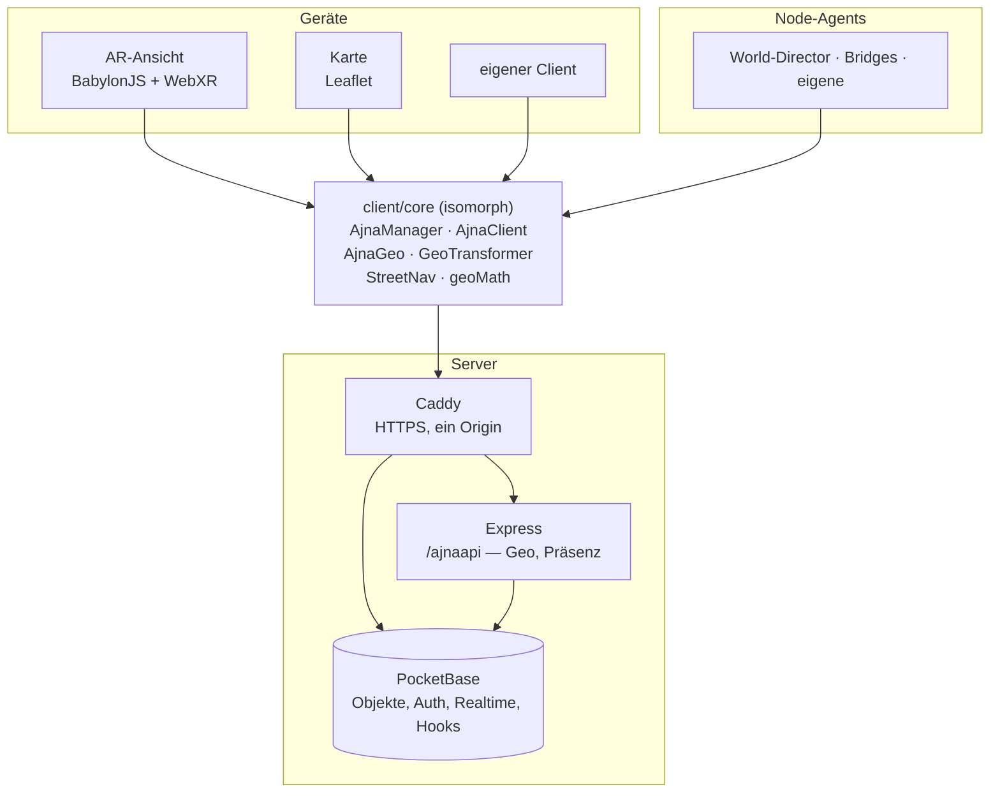
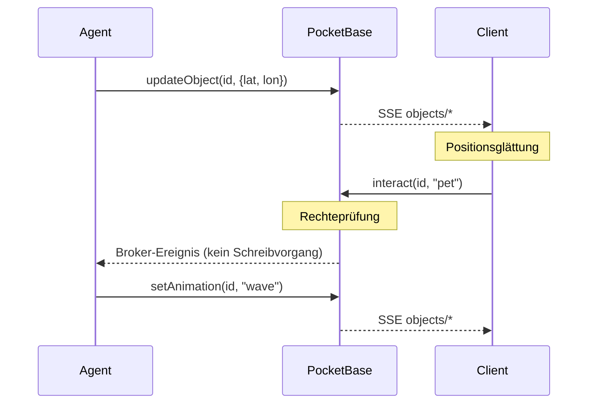
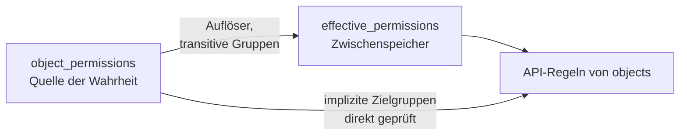
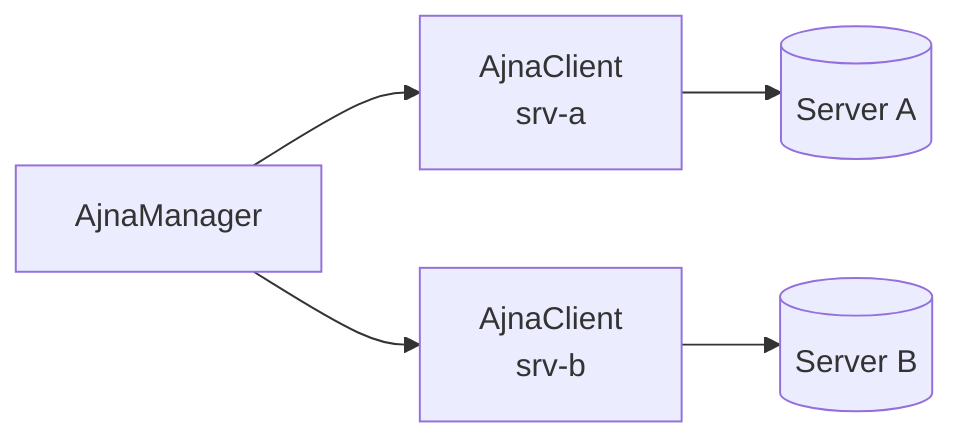

# Architektur

<!-- nav -->
[← Inhalt](Home.md#inhalt) · Entwickeln: [Einen Agent bauen](Einen-Agent-bauen.md) · [Ajna-Library](Ajna-Library.md) · [Agent-Library](Agent-Library.md) · [Objektmodell](Objektmodell.md) · **Architektur**
<!-- /nav -->

<!-- seiteninhalt -->
**Auf dieser Seite:** [Überblick](#überblick) · [Schichten](#schichten) · [Koordinaten](#koordinaten) · [Echtzeit](#echtzeit) · [Rechte](#rechte) · [Federation](#federation) · [Kulisse und Gelände](#kulisse-und-gelände) · [Verzeichnisse](#verzeichnisse) · [Tests](#tests)
<!-- /seiteninhalt -->

Für alle, die eigene Clients bauen oder verstehen wollen, warum die Dinge liegen, wo sie liegen.

## Überblick



Die Bibliothek liegt **einmal** und wird von beiden Seiten benutzt: im Browser gebündelt, in Node direkt importiert. Ein Agent, der Geo-Mathematik braucht, nimmt dieselbe Datei wie der Renderer — schon deshalb können beide nicht auseinanderlaufen.

## Schichten

| Schicht | Ort | Zuständig für |
|---|---|---|
| Geo und Welt | `client/core/GeoTransformer.js` | WGS84 ↔ lokale Meter |
| Bibliothek | `client/core/Ajna*.js` | Auth, Objekte, Echtzeit, Rechte |
| Darstellung | `client/engine/` | BabylonJS-Szene, Komponenten, Beschriftungen |
| Oberfläche | `client/core/*UI.js`, `MobileShell.js` | Reiter, Dialoge, Einstellungen |
| Debug | `client/engine/debug/` | Getrennt, damit es nicht in den Normalbetrieb sickert |

Datenmodelle des Servers greifen **nicht** direkt auf Engine-Komponenten zu; dazwischen liegt eine Übersetzung von PocketBase-Datensätzen nach Engine-Zustand.

## Koordinaten

Der Client rechnet reale Koordinaten in lokale Meter um, äquirektangulär um einen Ursprung.

- **Z = Nord, X = Ost, Y = Höhe**, eine Einheit = ein Meter
- Der Ursprung ist die erste bekannte Spielerposition
- Kein Neusetzen des Ursprungs nötig: Babylon rechnet in 32-Bit-Gleitkomma, bei 10 km Abstand bleibt etwa ein Millimeter Auflösung

Die AR-Ansicht läuft mit gespiegelter Nord-Süd-Achse, damit die Standard-Blickrichtung der Kamera zur Kartenanschauung passt. Wer aus lokalen Achsen einen Kompasskurs zurückrechnet, projiziert deshalb **zwei Punkte durch dieselbe Transformation**, statt Vorzeichen zu raten.

## Echtzeit



Zwei Wege mit Absicht:

- **Objektänderungen** gehen durch die Datenbank und werden verteilt — sie sind dauerhaft.
- **Interaktionen und Nähe** laufen über einen Broker **ohne** Schreibvorgang. Sie sind flüchtig; sie zu speichern hieße, die Datenbank mit Ereignissen zu fluten, die niemand nachlesen will.

Der Client hält zwei Sicherungen: Bei jedem Neuaufbau der Verbindung lädt er die Objektliste neu (SSE kennt keine Wiederholung verpasster Ereignisse), und ein Abgleich alle 30 Sekunden fängt einzelne verlorene Ereignisse ab.

### Warum Positionen nicht über den vollen Abgleich laufen

Ein Realtime-Ereignis je Objektänderung würde bei jedem Ereignis einen vollständigen Szenenabgleich auslösen — das kostete bei einem belebten Server messbar Bildrate. Reine Positionsänderungen eines bereits gezeichneten Objekts gehen deshalb auf einem Schnellweg direkt in das betroffene Objekt; der volle Abgleich läuft nur noch bei strukturellen Änderungen und gedrosselt.

**Für eigene Clients heißt das:** `onObjectEvent` nehmen und gezielt reagieren, nicht bei jedem Ereignis über `getObjects()` iterieren.

## Rechte



Der Zwischenspeicher existiert, weil PocketBase-Filter keine rekursive Gruppenauflösung können. Er wird von Hooks bei jeder relevanten Änderung nachgeführt. Implizite Zielgruppen (`authenticated`, `anonymous`, `everyone`) stehen nicht darin — sie werden direkt in den Regeln geprüft. Siehe [Berechtigungen](Berechtigungen.md).

## Federation

Ein Client kann sich mit mehreren Servern gleichzeitig verbinden. Die Server selbst reden **nicht** miteinander.



Jeder Server hat eigene Anmeldung, eigene Gruppen, eigenes Inventar und eine eigene Standort-Freigabestufe. Zusammengeführt wird nur die Anzeige. Objekt-IDs tragen deshalb den Server als Präfix, siehe [Ajna-Library](Ajna-Library.md).

## Kulisse und Gelände

Die AR-Ansicht zeichnet Straßen, Gebäude und Gewässer als Drahtgitter, dazu ein Höhenrelief aus offenen Höhenkacheln. Beides zieht der Kamera nach — mit Hysterese, weil ein Neuaufbau spürbar kostet und nicht bei jedem Schritt passieren darf.

Die Kachelquelle liefert ganze Kacheln von etwa 2,4 km; der eingestellte Radius wählt aus, welche geholt werden, **und** beschneidet danach die Merkmale. Ohne den zweiten Schritt wäre die gezeichnete Kulisse auf Kachelgrenzen gerastert und der Reichweitenregler wirkungslos.

Das Relief wird immer mindestens so groß gebaut wie die Kulisse: Straßen und Gebäude legen sich auf dessen Höhendaten, sonst lägen die äußeren flach.

## Verzeichnisse

```
client/
  core/          Bibliothek + Oberfläche (isomorph, auch von Agents genutzt)
  engine/        BabylonJS: GameObject, Komponenten, Beschriftungen, Umgebung
  engine/debug/  Debug-Ebenen, getrennt gehalten
  poc/           Vorstudien (SLAM)
server/          Express: /ajnaapi/* (Geo, Interessensbereiche)
pocketbase/
  pb_hooks/      JSVM: Rechte-Auflöser, eigene Routen
  pb_migrations/ Schema
agents/
  lib/           Node-spezifischer Unterbau (bootAgent, Assistent, Env)
  *.mjs          Die Agents selbst
tools/           Kommandozeilenwerkzeuge (ajna.mjs, acl-selftest.mjs)
tests/           E2E-Suiten + Sammelläufer für Modul-Tests
wiki/            Diese Dokumentation
```

## Tests

```bash
npm test              # alles
npm run test:unit     # nur Rechnung, kein Server nötig
```

`test:unit` findet alle `*.test.mjs` neben ihren Modulen selbst. Die übrigen Suiten (`test:ui`, `test:landing`, `test:quests`, `test:privacy`) brauchen eine erreichbare Instanz.

<!-- navfuss -->
---

← [Objektmodell](Objektmodell.md) · [Inhalt](Home.md#inhalt)
<!-- /navfuss -->
