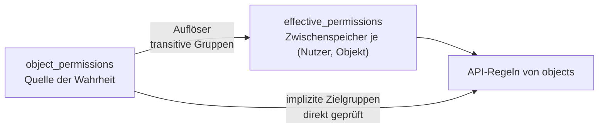

# Berechtigungen

<!-- nav -->
[← Wiki-Übersicht](Home.md) · Betreiben: [Server betreiben](Server-betreiben.md) · [Agents betreiben](Agents-betreiben.md) · **Berechtigungen**
<!-- /nav -->

Rechte werden **pro Objekt** vergeben, ähnlich wie Dateirechte unter NTFS: eine Liste von Einträgen, die einem Subjekt Rechte zuweisen.

## Rechte

| Recht | Wirkung |
|---|---|
| `view` | Objekt ist sichtbar — Liste, Einzelabruf, Echtzeit |
| `edit` | Beliebige Felder änderbar |
| `move` | Nur `lat`, `lon`, `altitude` änderbar |
| `owner` | Darf Rechte verwalten. Nur für `user` und `group` zulässig |

`interact_actions` ist eine **eigene** Liste, unabhängig von den Rechten: erlaubte Aktionsnamen wie `["attack", "pet"]` oder `["*"]` für alles. Sie wird bei `interact()` gegen die angeforderte Aktion geprüft.

Damit lässt sich trennen, was sich in der Praxis unterscheidet: jemand darf ein Objekt **sehen und ansprechen**, aber nicht **verändern**.

## Subjekte

| `subject_type` | `subject` | Bedeutung |
|---|---|---|
| `user` | Benutzer-ID | Ein bestimmter Mensch |
| `group` | Gruppen-ID | Alle Mitglieder, auch über Untergruppen |
| `authenticated` | leer | Jeder Angemeldete |
| `anonymous` | leer | Jeder Nicht-Angemeldete |
| `everyone` | leer | Beide zusammen |

Die letzten drei heißen **implizite Zielgruppen**: sie brauchen keine Mitgliederliste.

```js
// Alle Angemeldeten dürfen sehen und streicheln
await ajna.addPermission(obj.id, {
  subject_type: 'authenticated',
  rights: ['view'],
  interact_actions: ['pet'],
})

// Eine Gruppe darf zusätzlich verschieben
await ajna.addPermission(obj.id, {
  subject_type: 'group',
  subject: gruppenId,
  rights: ['view', 'move'],
})
```

Mehrere Einträge **addieren** sich — es gibt kein Verbot, das ein Erlaubnis übersteuert. Rechte werden also nur hinzugefügt, nie entzogen.

## Standard-Rechte

Ohne Zutun sieht nur der Eigentümer, was er anlegt. Damit das nicht bei jedem Objekt neu eingestellt werden muss, trägt jedes Konto eine Vorlage, die neue Objekte automatisch erben:

```js
await ajna.setMyDefaultPermissions([
  { subject_type: 'authenticated', rights: ['view'] }
])
```

Einstellbar auch in der App unter *Einstellungen → Verwaltung → Profil* oder direkt in der PocketBase-Administration im Feld `default_permissions`.

**Für Agents ist das die wichtigste Einstellung überhaupt.** Fehlt sie, legt der Agent fleißig unsichtbare Objekte an.

## Gruppen

Gruppen können Untergruppen enthalten; die Auflösung ist transitiv.

```js
const g = await ajna.createGroup('Nachbarschaft', { members: [userId] })
await ajna.updateGroup(g.id, { subgroups: [andereGruppeId] })

await ajna.inviteToGroup(g.id, 'freund@example.com')
// Auf der Gegenseite:
const offen = await ajna.listIncomingInvitations()
await ajna.acceptInvitation(offen[0].id)
```

Mitglied wird man nur über eine angenommene Einladung — niemand wird ungefragt hinzugefügt.

## Wie es intern funktioniert



Der Zwischenspeicher existiert, weil PocketBase-Filter keine rekursive Gruppenauflösung beherrschen. Hooks pflegen ihn bei jeder relevanten Änderung nach. Implizite Zielgruppen stehen nicht darin; sie werden direkt geprüft.

Praktische Folge: `myRights()` liest den Zwischenspeicher und deckt Besitz sowie Benutzer- und Gruppeneinträge ab. Rechte, die nur über eine implizite Zielgruppe bestehen, tauchen dort **nicht** auf — für sie gilt „sichtbar heißt `view`". Wer die vollständige Antwort braucht, nimmt `getEffectiveRights()`.

## Prüfen

```bash
node tools/acl-selftest.mjs
AJNA_URL=http://127.0.0.1:8090 node tools/acl-selftest.mjs   # an Caddy vorbei
```

Legt ein Wegwerf-Konto samt Testobjekt an und geht jeden Regelpfad einzeln durch — Zwischenspeicher-Lesen, `view`, `edit`, Rechteliste, Rechte anlegen, Löschen. Räumt das Testobjekt hinterher weg.

## Grenzen

- **Kein Verbotseintrag.** Rechte addieren sich. Wer etwas entziehen will, entfernt den Eintrag, der es gewährt.
- **Kein Erben über Container.** Es gibt keine Objekthierarchie, aus der Rechte fließen — jedes Objekt trägt seine eigenen.
- **Zyklen bei Untergruppen** werden derzeit nur eine Ebene tief verhindert.

Vollständige Beschreibung samt Datenmodell, API-Regeln und Einladungssystem: [`docs/permissions.md`](https://github.com/blckwngd/Ajna/blob/main/docs/permissions.md).

<!-- navfuss -->
---

← [Agents betreiben](Agents-betreiben.md) · [Übersicht](Home.md) · [Einen Agent bauen](Einen-Agent-bauen.md) →
<!-- /navfuss -->
