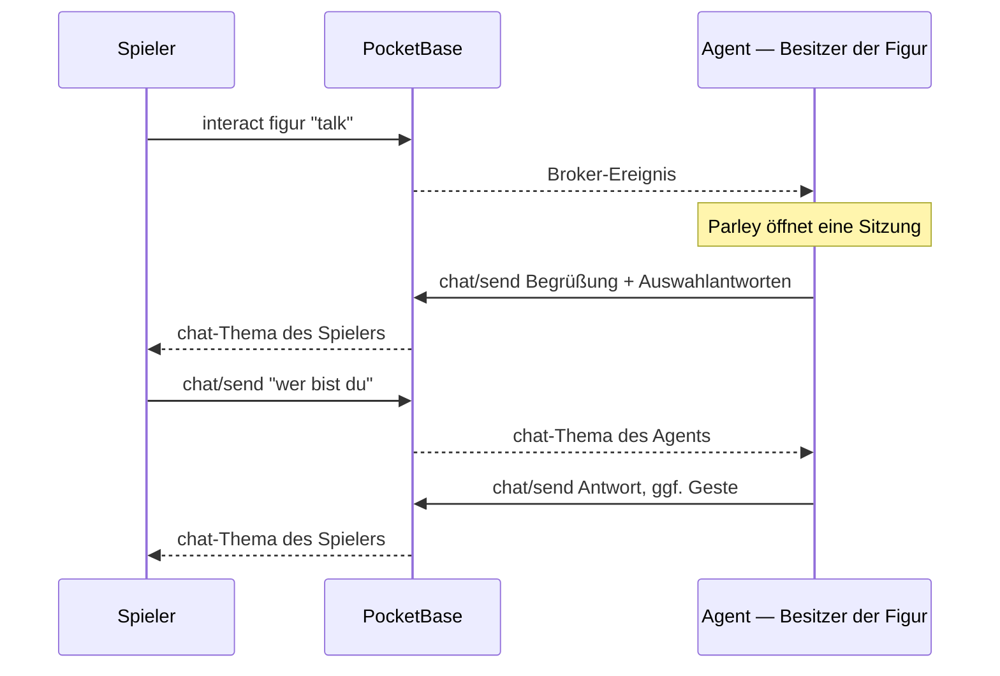
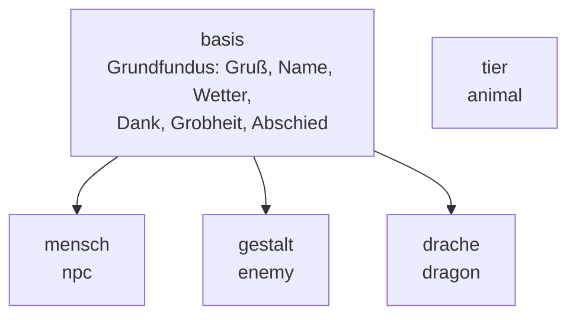

# Dialoge

<!-- nav -->
[← Inhalt](Home.md#inhalt) · Entwickeln: [Einen Agent bauen](Einen-Agent-bauen.md) · [Ajna-Library](Ajna-Library.md) · [Agent-Library](Agent-Library.md) · [Objektmodell](Objektmodell.md) · **Dialoge** · [Architektur](Architektur.md)
<!-- /nav -->

<!-- seiteninhalt -->
**Auf dieser Seite:** [Wie ein Gespräch abläuft](#wie-ein-gespräch-abläuft) · [Im Client](#im-client) · [Die mitgelieferten Dialogsätze](#die-mitgelieferten-dialogsätze) · [Ein eigener Dialogsatz](#ein-eigener-dialogsatz) · [Aus dem eigenen Agent](#aus-dem-eigenen-agent) · [Objekt-eigene Dialoge](#objekt-eigene-dialoge) · [Konfiguration (World-Director)](#konfiguration-world-director) · [Grenzen](#grenzen) · [Tests](#tests)
<!-- /seiteninhalt -->


Figuren, mit denen man reden kann — ohne Sprachmodell, ohne Netzabhängigkeit,
ohne laufende Kosten. Die Gespräche laufen über **Parley**, eine kleine
Dialogsprache in JSON, die als eigenständiges Paket unter [`/parley`](../parley/README.md)
liegt und über die Ajna-Library eingebunden wird.

## Wie ein Gespräch abläuft

Der Chat ist Konto-zu-Konto, nicht Objekt-zu-Objekt. Wer eine Figur anspricht,
schreibt in Wahrheit dem **Konto, dem die Figur gehört** — mitgeschickt wird,
welche Figur gemeint war. Derselbe Weg trägt später Direktnachrichten zwischen
Spielern.



Zwei Dinge folgen daraus:

- **Ephemer.** Nachrichten werden nicht gespeichert. Läuft der Agent nicht,
  antwortet niemand — der Client meldet das („antwortet nicht — niemand ist da").
- **Eine Sitzung je Spieler UND Figur.** Zwei Spieler reden unabhängig
  voneinander mit derselben Person; derselbe Spieler führt mit zwei Figuren
  zwei getrennte Gespräche.

## Im Client

„Sprechen" im Objektmenü schaltet das Verlaufsfenster in einen Privatchat mit
der Figur: Kopfzeile mit ihrem Namen, Eingabefeld, Auswahlantworten. Ohne
Gegenüber bleibt das Feld verborgen — es gäbe niemanden zum Anschreiben, und
einen Weltchat gibt es noch nicht.

Jede eingehende Zeile läuft zusätzlich als **Toast** über den Bildschirm, mit
dem Namen der Figur als Überschrift. Man muss das Fenster also nicht offen
halten, um zu sehen, was jemand sagt.

Meldet sich eine Figur, mit der gerade kein Gespräch läuft, übernimmt das
Fenster sie automatisch als Gegenüber — das Eingabefeld ist dann da, sobald man
es öffnet. Nötig ist das, weil „Sprechen" aus der AR- und der Kartenansicht in
eigenen Bündeln läuft, die das Panel nicht selbst kennen.

Bietet die Antwort Auswahlantworten an, stehen sie als Knöpfe über der
Eingabezeile. Ob daneben noch frei getippt werden darf, entscheidet die Figur
(`input`, siehe unten).

## Die mitgelieferten Dialogsätze

Sie liegen als JSON in `/dialogs` und erben voneinander:



| Satz | Archetyp | Charakter |
|---|---|---|
| `basis` | — | Was jede sprechende Figur können muss. Wird nie direkt benutzt. |
| `mensch` | `npc` | Freundlich, gesprächig, erzählt Gerüchte. Wird nach genug Small Talk vertraulich. |
| `gestalt` | `enemy` | Wortkarg und grimmig — und gibt nach genug Nachfragen zu, dass das nur Fassade ist. |
| `tier` | `animal` | Antwortet **nicht** in Sätzen, sondern in Beobachtungen. Wird zutraulich, wenn man es füttert. |
| `drache` | `dragon` | Groß im Auftritt, klein im Alltag. |

`tier` erbt bewusst **nicht** von `basis`: ein Reh, das die Uhrzeit erklärt,
nimmt der Welt mehr, als es ihr gibt.

Welcher Satz greift, entscheidet `state.archetype`. Eine einzelne Figur kann
über `state.dialog_set` einen anderen verlangen und über `state.dialog_vars`
eigene Startvariablen mitgeben.

## Ein eigener Dialogsatz

Eine neue Datei `dialogs/wirtin.parley.json`:

```jsonc
{
  "name": "wirtin",
  "extends": "mensch",
  "_note": "Erbt alles von mensch; hier steht nur, was sie anders macht.",
  "vars": { "bier": 0 },
  "rules": [
    {
      "_note": "Steht ZUERST: gleiche Muster wie unten, aber engere Bedingung.",
      "when": ["* bier *"],
      "if": { "bier": { ">=": 5 } },
      "then": "Für heute reicht es. Ich rufe dir jemanden, der dich nach Hause bringt.",
      "do": ["anim:wave"],
      "suggest": false
    },
    {
      "label": "bier",
      "when": ["* bier *", "* etwas zu trinken *"],
      "then": ["Kommt sofort.", "Nummer {bier} heute. Aber wer zählt schon."],
      "set": { "bier": { "+": 1 } },
      "suggest": "ein bier bitte"
    }
  ]
}
```

Der Agent lädt beim Start alles aus `/dialogs`; ein Neustart genügt. Die
vollständige Formatbeschreibung — Muster, Bedingungen, Platzhalter, Vererbung —
steht in der [Parley-README](../parley/README.md).

**Zwei Fallen beim Schreiben:**

- Die Reihenfolge entscheidet. Eine engere Regel muss **über** der allgemeinen
  stehen, sonst kommt sie nie dran.
- `?` ist im Muster kein Satzzeichen, sondern der Platzhalter für genau ein
  Wort. `wie geht es dir?` verlangt also ein zusätzliches Wort am Ende.
  Fragezeichen gehören in die Antwort.

## Aus dem eigenen Agent

```js
import { npcParley } from './lib/dialogs.mjs'
import { dialogNameFor, dialogVarsFor, talkSessionId } from '../client/core/Parley.js'

const parley = npcParley()               // lädt /dialogs

ajna.onChat(async (msg) => {
  const obj = meineObjekte.find(o => o.id === msg.object)
  if (!obj) return

  const chat = parley.open(dialogNameFor(obj), talkSessionId(msg.from, obj.id),
                           { vars: dialogVarsFor(obj) })
  const antwort = chat.say(msg.text)
  if (!antwort.text) return

  await ajna.sendChat(msg.from, {
    text: antwort.text,
    object: obj.id,
    meta: antwort.choices ? { choices: antwort.choices, input: antwort.input } : null,
  })

  for (const a of antwort.do) {
    if (a.action === 'anim') await ajna.setAnimation(obj.id, a.value)
  }
})

// Alte Gespräche vergessen, sonst wächst die Sitzungstabelle unbegrenzt.
setInterval(() => parley.sweep(15 * 60_000), 60_000)
```

Damit der Client „Sprechen" überhaupt anbietet, braucht die Figur die Aktion
`talk` in `state.actions` **und** in den `interact_actions` ihrer ACE — siehe
[Objektmodell](Objektmodell.md) und [Berechtigungen](Berechtigungen.md).

### Aktionen

`do` liefert, was der Dialog auslösen soll. Parley führt nichts selbst aus — es
weiß nicht, in welchem Programm es steckt. Der World-Director setzt bewusst nur
`anim` um:

| Aktion | Wirkung |
|---|---|
| `anim:<name>` | Animation abspielen (`wave`, `dance`, `jump`, `idle`, `walk` …). Die Figur bleibt für die Dauer stehen. |

Alles Weltverändernde — Gegenstände übergeben, Türen öffnen, Aufträge vergeben —
gehört **nicht** in einen Dialogsatz. Ein Dialogsatz ist Text, den irgendwann
jemand anders schreibt; die Rechteprüfung bleibt beim Agent.

## Objekt-eigene Dialoge

Ein Objekt kann seinen Dialogsatz in `state.parley` mitbringen. Gedacht ist das
für Schilder, Tafeln und Automaten, die auch ohne laufenden Agent antworten.

**Vorbereitet, noch nicht verdrahtet:** `objectDialog(record)` liest und
entschärft das Dokument, aber die Oberfläche wertet es noch nicht lokal aus —
heute beantwortet immer der Besitzer-Agent.

Entschärfen ist nötig, weil `state` jeder Objektbesitzer schreiben darf:
höchstens 120 Regeln, 20 Muster je Regel, 6 Platzhalter je Muster. Ohne diese
Grenze könnte ein böswillig gebautes Muster den Browser eines **Besuchers**
beschäftigen, nicht den des Autors. Aktionen aus objekt-eigenen Dialogen dürfen
aus demselben Grund nur kosmetisch wirken.

## Konfiguration (World-Director)

| Variable | Vorgabe | Bedeutung |
|---|---|---|
| `WD_TALK` | `on` | `off` schaltet Gespräche ab |
| `WD_TALK_IDLE_S` | `900` | nach so vielen Sekunden Stille wird ein Gespräch vergessen |
| `WD_TALK_MIN_MS` | `400` | Mindestabstand zwischen zwei Antworten an denselben Spieler |
| `WD_TALK_GESTURE_S` | `4` | wie lange eine Geste läuft |

## Grenzen

- **Kein Gedächtnis über Sitzungen hinweg.** Wer nach einer Viertelstunde
  Stille zurückkommt, wird neu begrüßt. `chat.toJSON()` könnte den Zustand
  sichern — der Director tut es nicht.
- **Kein Missbrauchsschutz auf dem Server.** Jeder Angemeldete darf jedem
  schreiben; der Director bremst nur sich selbst. Offener Punkt am
  Chat-Transport, nicht an Parley.
- **Kein Weltchat, keine Direktnachrichten zwischen Spielern.** Der Transport
  kann beides, die Oberfläche noch nicht.
- **Kein Verstehen.** Parley vergleicht Muster. Es kennt keine Synonyme, keine
  Rechtschreibkorrektur und keine Wortstämme — was nicht im Dialogsatz steht,
  landet im Fallback.

## Tests

```bash
npm run test:unit      # enthält parley/test/parley.test.mjs und agents/lib/dialogs.test.mjs
```

Der zweite Test führt echte Gespräche gegen die mitgelieferten Sätze und prüft,
dass jede Regel erreichbar ist — auch die, die hinter einer Bedingung liegen.
Er prüft **nicht** den Wortlaut: der darf sich ändern.

<!-- navfuss -->
---

← [Objektmodell](Objektmodell.md) · [Inhalt](Home.md#inhalt) · [Architektur](Architektur.md) →
<!-- /navfuss -->
