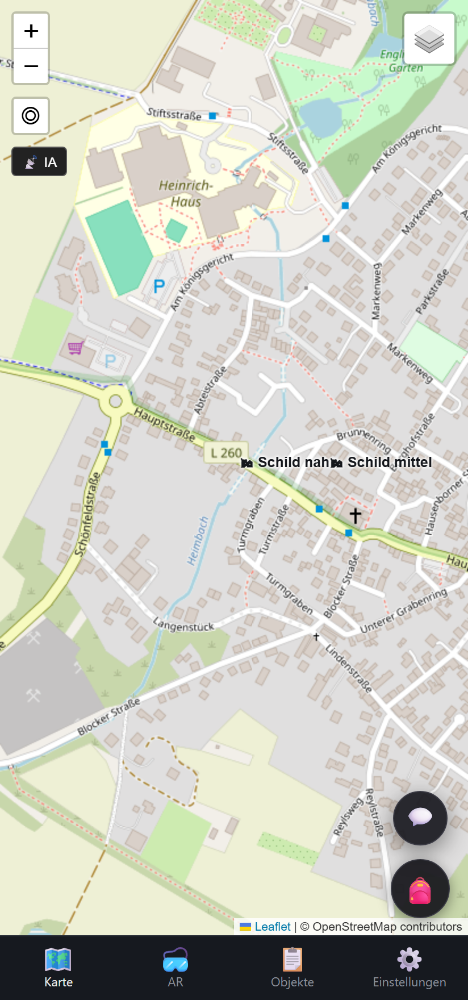
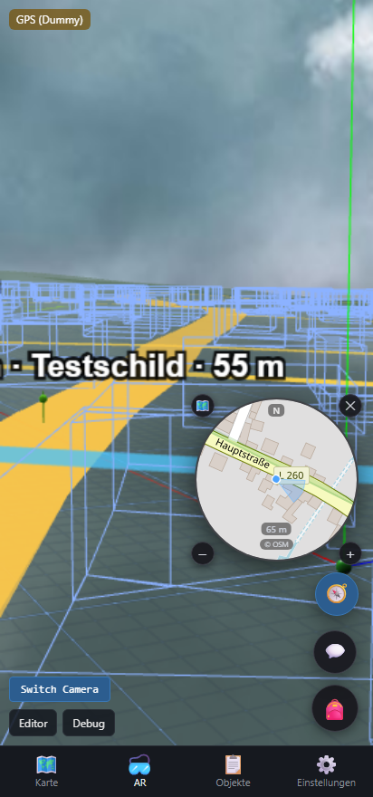
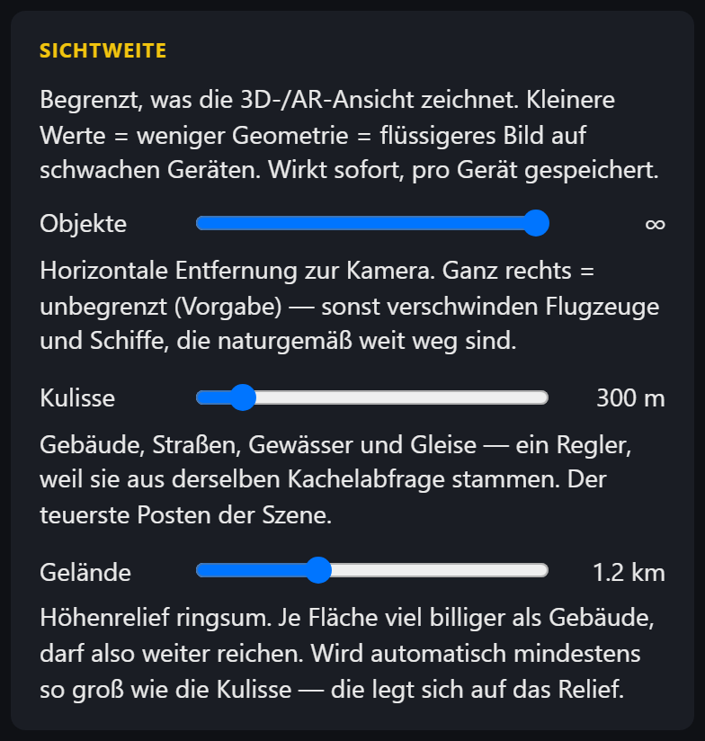

# Die App

<!-- nav -->
[← Inhalt](Home.md#inhalt) · Benutzen: [Erste Schritte](Erste-Schritte.md) · **Die App** · [Privatsphäre](Privatsphaere.md)
<!-- /nav -->

Der Haupt-Client liegt unter `/` und hat vier Reiter. Daneben gibt es Einzelseiten für Sonderfälle: `/index-map.html` (nur Karte, Desktop-Editor) und `/index-ar.html` (nur 3D/AR, ohne Reiterleiste).

## 🗺 Karte

Zweidimensionale Übersicht auf Basis von OpenStreetMap. Objekte erscheinen als Symbole an ihren echten Koordinaten.

- **Grundkarte umschalten** (oben rechts): hell, dunkel, Satellit. Die Wahl wird gemerkt.
- **Objekt antippen** öffnet das Aktionsmenü — welche Aktionen erscheinen, hängt von deinen Rechten am Objekt ab.
- **Eigene Objekte verschieben**: mit gedrücktem Zeiger ziehen.
- **Rechtsklick / langes Tippen** auf freie Fläche legt ein neues Objekt an dieser Stelle an.
- **Inhaltsfilter** (Knopf *Filter*): Agents melden an, welche Ebenen sie liefern. Hier wählst du pro Agent aus, was du sehen willst — z. B. POIs ja, WLAN-Netze nein.

## 🥽 AR

Entwicklungs-Instanz mit Testdaten; ohne immersives WebXR ersetzt eine Himmelskuppel das Kamerabild.

Dieselbe Welt in 3D, am selben Ort stehend. Mit immersivem WebXR mit Kamerabild, sonst als 3D-Vorschau.

- **Beschriftungen** schweben über den Objekten, an einer schmalen Säule zum Boden verankert. Sie skalieren mit der Entfernung; die angeschaute Tafel wird größer. Was draufsteht, bestimmt der Agent über `appearance.label` ([Objektmodell](Objektmodell.md)).
- **Kulisse**: Straßen, Gebäude und Gewässer aus OSM als Drahtgitter, dazu ein Höhenrelief. Beides zieht mit der Kamera mit.
- **Minimap** (🧭): runde Karte des aktuellen Kamerastandorts, nordorientiert, mit Blickkegel. Ziehen verschiebt sie, die vier Eckknöpfe schalten Kartenstil, Zoom und Schließen.
- **Inventar** (🎒) und **Verlauf** (💬) liegen als schwebende Knöpfe daneben.
- **Schnellzugriff**: das anvisierte Objekt zeigt am rechten Rand seine wichtigsten Aktionen.

## 📋 Objekte

Liste der nächstgelegenen Objekte mit Entfernung — nützlich, wenn ein Objekt hinter einer Hauswand liegt oder die Karte zu voll ist. Von hier aus lassen sich dieselben Aktionen auslösen wie auf der Karte.

## ⚙️ Einstellungen

Alle Einstellungen gelten **pro Gerät** und liegen lokal im Browser.

| Abschnitt | Inhalt |
|---|---|
| **Zugang** | Anmelden, abmelden, Server verwalten (mehrere gleichzeitig möglich) |
| **Verwaltung** | Gruppen, Profil, Standard-Rechte für neue Objekte |
| **Privatsphäre** | Standort-Freigabe je Server, siehe [Privatsphäre](Privatsphaere.md) |
| **Audio** | Namen und Aktionen vorlesen lassen |
| **Sichtweite** | Wie weit Objekte, Kulisse und Gelände gezeichnet werden |
| **AR-Ansicht** | Blickfeld, Nord-Offset, Augenhöhe, Kompass-Anzeige, Objekt-Aura, Tracking |
| **Geräte** | Zauberstab und UWB-Module verbinden |
| **Hintergrund** | Verhalten der mobilen App im Hintergrund |
| **Standort** | Quelle der Position, Testmodus |
| **Debug** | Ebenen ein-/ausblenden, Diagnose |

### Sichtweite

Drei Regler begrenzen, was die 3D-Ansicht zeichnet — der wirksamste Hebel gegen Ruckeln auf schwachen Geräten.

- **Objekte** — horizontale Entfernung zur Kamera. Ganz rechts heißt unbegrenzt und ist die Voreinstellung; sonst verschwinden Flugzeuge und Schiffe, die naturgemäß weit weg sind.
- **Kulisse** — Gebäude, Straßen, Gewässer, Gleise. Der teuerste Posten.
- **Gelände** — Höhenrelief ringsum. Wird automatisch mindestens so groß wie die Kulisse.

### Mehrere Server gleichzeitig

Unter *Zugang → Server* lassen sich weitere Instanzen hinzufügen. Der Client verbindet sich zu allen und zeigt deren Objekte nebeneinander; Anmeldung, Gruppen und Inventar bleiben **je Server getrennt**. Auch die Standort-Freigabe wird pro Server eingestellt — ein Server, dem du nicht traust, bekommt „Verborgen", während ein anderer „Genau" bekommt.

<!-- navfuss -->
---

← [Erste Schritte](Erste-Schritte.md) · [Inhalt](Home.md#inhalt) · [Privatsphäre](Privatsphaere.md) →
<!-- /navfuss -->
