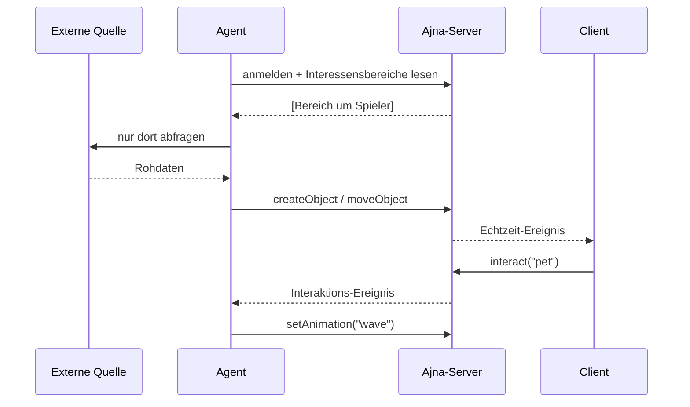

# Einen Agent bauen

<!-- nav -->
[← Inhalt](Home.md#inhalt) · Entwickeln: **Einen Agent bauen** · [Ajna-Library](Ajna-Library.md) · [Agent-Library](Agent-Library.md) · [Objektmodell](Objektmodell.md) · [Architektur](Architektur.md)
<!-- /nav -->

<!-- seiteninhalt -->
**Auf dieser Seite:** [Was ein Agent ist](#was-ein-agent-ist) · [Schritt 1 — Konto vorbereiten](#schritt-1--konto-vorbereiten) · [Schritt 2 — Gerüst](#schritt-2--gerüst) · [Schritt 3 — Nur abfragen, wo Spieler sind](#schritt-3--nur-abfragen-wo-spieler-sind) · [Schritt 4 — Objekte anlegen und pflegen](#schritt-4--objekte-anlegen-und-pflegen) · [Schritt 5 — Aufräumen](#schritt-5--aufräumen) · [Schritt 6 — Bewegung ohne Schreiblast](#schritt-6--bewegung-ohne-schreiblast) · [Schritt 7 — Auf Spieler reagieren](#schritt-7--auf-spieler-reagieren) · [Schritt 8 — Im Filter auftauchen](#schritt-8--im-filter-auftauchen) · [Schritt 9 — Sauber beenden](#schritt-9--sauber-beenden) · [Schritt 10 — Dauerbetrieb](#schritt-10--dauerbetrieb) · [Fallen, die Zeit kosten](#fallen-die-zeit-kosten) · [Weiter](#weiter)
<!-- /seiteninhalt -->

Wir bauen eine Bridge, die Daten aus einer externen Quelle als Ajna-Objekte spiegelt. Am Ende steht ein Agent, der nur dort abfragt, wo Spieler sind, Objekte anlegt und pflegt, aufräumt und einen Einrichtungsassistenten mitbringt.

Voraussetzung: eine laufende Instanz ([Server betreiben](Server-betreiben.md)) und ein Benutzerkonto für den Agenten.

## Was ein Agent ist

Nichts Besonderes: ein angemeldeter Client wie jeder andere. Kein Sonderprotokoll, keine Sonderrechte. Er darf genau das, was seinem Konto erlaubt ist.



## Schritt 1 — Konto vorbereiten

In der PocketBase-Administration ein Konto anlegen, z. B. `meinagent@example.com`, und ihm Standard-Rechte geben:

```json
[{ "subject_type": "authenticated", "rights": ["view"] }]
```

**Ohne das sieht niemand außer dem Agenten selbst, was er anlegt.** Der mit Abstand häufigste Anfängerfehler.

## Schritt 2 — Gerüst

`agents/mein-agent.mjs`:

```js
#!/usr/bin/env node
import { bootAgent, envNum, envStr } from './lib/agent-base.mjs'
import { simpleSetup } from './lib/setup-wizard.mjs'

const { ajna, url, log, warn } = await bootAgent('mein-agent', {
  setup: simpleSetup('mein-agent', {
    required: ['AJNA_USER', 'AJNA_PASS', 'MEIN_API_KEY'],
    optional: ['AJNA_URL', 'MEIN_RADIUS_KM'],
  }),
})

const RADIUS_KM = envNum('MEIN_RADIUS_KM', 5)
const SCHLUESSEL = envStr('MEIN_API_KEY')

log('verbunden mit', url)
```

Erster Lauf:

```bash
node agents/mein-agent.mjs --setup
```

Der Assistent fragt die Werte ab und schreibt `agents/.env.mein-agent` mit Dateirechten `0600`.

## Schritt 3 — Nur abfragen, wo Spieler sind

Externe Schnittstellen haben Kontingente. Ajna sagt dir, wo sich das Abfragen lohnt — anonymisiert, ohne dass du erfährst, wer dort ist.

```js
import { watchInterestAreas } from '../client/core/interestAreas.js'
import { centerOf } from '../client/core/geoMath.js'

async function takt(areas, { changed }) {
  if (!changed) return                     // nichts Neues → Kontingent schonen
  for (const area of areas) {
    const { lat, lon } = centerOf(area)
    await syncBereich(lat, lon)
  }
}

const watch = watchInterestAreas(ajna, 'mein-agent',
  { intervalMs: 60_000, maxAreas: 6 }, takt)

await watch.first
log('bereit. (Strg+C zum Beenden)')
```

`maxAreas` ist der Kontingentschutz: zehn Spieler an zehn Orten sind zehn Abfragen je Takt.

> **Leere Liste ist normal.** Steht niemand mit Freigabe „Gegend" oder höher auf dem Server, kommt nichts — und der Agent tut nichts. Zum Ausprobieren einen festen Mittelpunkt als Rückfall vorsehen.

## Schritt 4 — Objekte anlegen und pflegen

Der Kern jeder Bridge ist eine Zuordnung *externe ID → Ajna-Objekt-ID*. Damit wird Anlegen idempotent.

```js
const gesehen = new Map()
const zuletzt = new Map()

async function syncBereich(lat, lon) {
  for (const d of await quelleAbfragen(lat, lon, RADIUS_KM)) {
    zuletzt.set(d.id, Date.now())
    const vorhanden = gesehen.get(d.id)

    if (vorhanden) {
      await ajna.updateObject(vorhanden, {
        lat: d.lat, lon: d.lon,
        rotation: { x: 0, y: kursTiefe(d.kurs), z: 0 },
      })
      continue
    }

    const obj = await ajna.createObject({
      name: d.name,
      type: 'ding',
      lat: d.lat, lon: d.lon, altitude: 0,
      appearance: {
        shape: 'emoji', emoji: '📦',
        label: '{name} · {distance}',
      },
      state: { source: 'mein-agent', extern_id: d.id },
    })
    gesehen.set(d.id, obj.id)
  }
}
```

**`state.source` ist Pflicht.** Es markiert deine Objekte, schützt fremde vor deinem Aufräumen und speist den Inhaltsfilter der App.

Was in `appearance` darf, steht im [Objektmodell](Objektmodell.md).

## Schritt 5 — Aufräumen

Was aus der Quelle verschwindet, muss auch aus Ajna verschwinden — sonst wächst die Welt zu.

```js
const VERFALL_MS = 10 * 60 * 1000

setInterval(async () => {
  const jetzt = Date.now()
  for (const [externId, objektId] of gesehen) {
    if (jetzt - (zuletzt.get(externId) || 0) < VERFALL_MS) continue
    try {
      await ajna.deleteObject(objektId)
      gesehen.delete(externId)
      zuletzt.delete(externId)
    } catch (err) { warn('Aufräumen:', err?.message || err) }
  }
}, 60_000)
```

Nur eigene Objekte löschen. Wer über `getObjects()` geht statt über die eigene Zuordnung, filtert zwingend auf `state.source`.

## Schritt 6 — Bewegung ohne Schreiblast

Bewegt sich etwas und fragst du selten ab, springen die Objekte. Statt häufiger zu schreiben, veröffentliche einen **Bewegungsvektor** — der Client rechnet die Zwischenschritte selbst:

```js
await ajna.updateObject(objektId, {
  lat: d.lat, lon: d.lon, altitude: d.hoehe,
  state: {
    source: 'mein-agent', extern_id: d.id,
    motion: {
      v: d.tempo,        // m/s
      trk: d.kurs,       // Grad, 0 = Nord
      vrate: d.steigen ?? 0,
      lat0: d.lat, lon0: d.lon, alt0: d.hoehe,
      t: Date.now(),
    },
  },
})
```

Wirkt sofort in Karte **und** AR. Details im [Objektmodell](Objektmodell.md).

## Schritt 7 — Auf Spieler reagieren

```js
// Jemand interagiert mit einem Objekt
await ajna.onInteract(objektId, async ev => {
  if (ev.action === 'pet') await ajna.setAnimation(objektId, 'wave')
})

// Jemand kommt in die Nähe
await ajna.onProximity(objektId, async ev => {
  await ajna.setAnimation(objektId, ev.state === 'enter' ? 'wave' : 'idle')
})

// Auf neue Objekte anderer Agents reagieren
ajna.onObjectEvent((rec, action) => {
  if (action === 'create' && rec.type === 'ship') log('neues Schiff:', rec.name)
})
```

Für `onInteract` und `onProximity` braucht der Agent `connect: true` in `bootAgent`.

## Schritt 8 — Im Filter auftauchen

Damit Spieler deine Ebenen ein- und ausschalten können:

```js
import { publishManifest } from './lib/agent-base.mjs'

await publishManifest(ajna, {
  source: 'mein-agent',
  agent_name: 'Mein Agent',
  description: 'Spiegelt Dinge aus der Beispielquelle',
  layers: [
    { key: 'dinge',   label: 'Dinge',   default: true },
    { key: 'details', label: 'Details', default: false },
  ],
})
```

## Schritt 9 — Sauber beenden

```js
const { ajna, log } = await bootAgent('mein-agent', { sigint: false })

process.on('SIGINT', async () => {
  log('räume auf …')
  try { for (const id of gesehen.values()) await ajna.deleteObject(id) } catch {}
  process.exit(0)
})
```

Ob beim Beenden aufgeräumt wird, ist eine Entscheidung: Schiffe sollen verschwinden, gesetzte Figuren dürfen bleiben.

## Schritt 10 — Dauerbetrieb

```bash
pm2 start agents/mein-agent.mjs --name ajna-mein-agent
pm2 save
```

Und optional in `package.json`:

```json
"scripts": { "mein-agent": "node agents/mein-agent.mjs" }
```

---

## Fallen, die Zeit kosten

| Symptom | Ursache |
|---|---|
| Agent legt an, niemand sieht etwas | Standard-Rechte am Konto fehlen (Schritt 1) |
| Agent tut nichts, keine Fehlermeldung | Keine Interessensbereiche — kein Spieler mit Freigabe „Gegend" |
| `unable to verify the first certificate` | HTTPS mit Caddys interner Zertifizierungsstelle. `bootAgent` löst das durch Neustart mit `--use-system-ca` — nur wenn du `bootAgent` benutzt |
| Figuren springen oder zittern | Zwei Prozesse desselben Agenten. Unter Windows besonders leicht passiert |
| Server wird langsam, Clients ruckeln | Zu häufige `updateObject`-Aufrufe. Auf `state.motion` umstellen (Schritt 6) |
| Aufräumen löscht fremde Objekte | Über `getObjects()` gelöscht, ohne auf `state.source` zu filtern |

## Weiter

- [Ajna-Library](Ajna-Library.md) — alle Methoden
- [Agent-Library](Agent-Library.md) — `bootAgent`, Assistent, Wegplanung
- [Objektmodell](Objektmodell.md) — `appearance` und `state` im Detail

Als Vorlage eignet sich `agents/poi-bridge.mjs` — die kompakteste vollständige Bridge im Bestand.

<!-- navfuss -->
---

← [Berechtigungen](Berechtigungen.md) · [Inhalt](Home.md#inhalt) · [Ajna-Library](Ajna-Library.md) →
<!-- /navfuss -->
