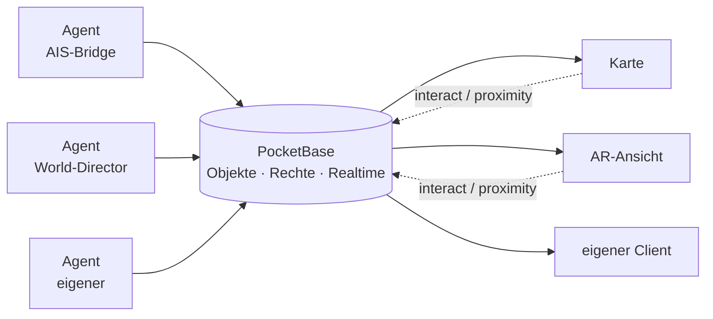

# Ajna

Ajna legt eine dauerhafte, gemeinsame Ebene über die reale Welt. Objekte haben echte Koordinaten, liegen dort für alle Berechtigten gleichzeitig und bleiben liegen, wenn niemand hinschaut. Man sieht sie auf einer Karte oder — am selben Ort stehend — in AR durch die Kamera.

Es ist kein Spiel mit fester Regelwelt, sondern der Unterbau dafür: Objekte, Rechte, Echtzeit-Verteilung und Programme, die die Welt bevölkern.

→ Direkt zum **[Inhaltsverzeichnis](#inhalt)**

---

## Features

### 🌍 Die Welt

| | |
|---|---|
| **Ortsgebundene Objekte** | Alles hat echte WGS84-Koordinaten und eine Höhe. Ein Objekt liegt an einem Ort, nicht in einer Sitzung. |
| **Dauerhaft und geteilt** | Der Zustand lebt auf dem Server. Wer später vorbeikommt, findet dieselbe Welt vor. |
| **Zwei Blicke, eine Welt** | Karte für die Übersicht, AR für den Ort. Dieselben Objekte, dieselben Rechte, dieselben Aktionen. |
| **Echte Kulisse** | Straßen, Gebäude und Gewässer aus OpenStreetMap, dazu ein Höhenrelief — die 3D-Ansicht steht in der wirklichen Landschaft. |
| **Beschriftungen mit Entfernung** | Tafeln über den Objekten, am Boden verankert, mit der Distanz. Nach Entfernung skaliert, die angeschaute größer. |

### 🔐 Rechte und Privatsphäre

| | |
|---|---|
| **Rechte je Objekt** | NTFS-artig: `view`, `edit`, `move`, `owner` — für Personen, Gruppen oder implizite Zielgruppen. Interaktionen werden getrennt freigegeben. |
| **Gruppen mit Untergruppen** | Transitiv aufgelöst, Mitgliedschaft nur per angenommener Einladung. |
| **Standort in vier Stufen** | Verborgen · Gegend · Nähe · Genau — **je Server** einstellbar und gerätelokal gespeichert. |
| **Anonymisierte Präsenz** | Agents erfahren nur ein grobes Aggregat, nie wer wo ist. Nähe wird als Objekt-ID gemeldet, nie als Koordinate. |

### 🤖 Agents

| | |
|---|---|
| **Ein Agent ist ein normaler Client** | Kein Sonderprotokoll, keine Sonderrechte. Was er darf, entscheidet sein Konto. |
| **Daten, niemals Code** | Aussehen ist deklaratives JSON. Ein Agent kann nichts in den Client injizieren — das ist baulich ausgeschlossen. |
| **Mitgeliefert** | Schiffe (AIS), Flugzeuge (ADS-B), WLAN-Netze (WiGLE), Wildtiere (Movebank), Punkte von Interesse (OSM), Smart Home (Home Assistant) und ein World-Director, der Figuren über das Straßennetz laufen lässt. |
| **Nur dort, wo jemand ist** | Bridges fragen ihre Quelle entlang der Interessensbereiche ab — das schont Kontingente und Privatsphäre zugleich. |
| **Gemeinsamer Unterbau** | `bootAgent()` erledigt Konfiguration, Einrichtungsassistent, Zertifikate und Anmeldung. Ein neuer Agent beginnt bei der Fachlogik. |

### ⚡ Technik

| | |
|---|---|
| **Echtzeit** | Objektänderungen über SSE an alle Clients. Interaktionen und Nähe laufen über einen Broker **ohne** Datenbankschreibung. |
| **Bewegung ohne Schreiblast** | Agents veröffentlichen einen Bewegungsvektor statt einer Positionsfolge; der Client rechnet jedes Bild voraus. |
| **Mehrere Server gleichzeitig** | Ein Client verbindet sich mit mehreren Instanzen und sieht deren Inhalte nebeneinander — getrennte Anmeldung, Gruppen und Inventare. |
| **Eine Bibliothek für beide Seiten** | Derselbe Quelltext im Browser und in Node. Agent und Renderer rechnen mit derselben Geo-Mathematik. |
| **Aufträge und Inventar** | Gegenstände aufnehmen und ablegen; Aufträge mit treuhänderisch gebundener Belohnung und atomarem Tausch. |
| **Ein Origin** | Caddy bündelt Client, Datenbank und API unter einer Adresse — kein Mixed-Content, ein Speicherbereich. |

---

## Inhalt

### 🧭 Benutzen

Du willst Ajna auf einem Server nutzen, den jemand anders betreibt.

| Seite | Inhalt |
|---|---|
| **[Erste Schritte](Erste-Schritte.md)** | Voraussetzungen, Anmeldung, Standort-Stufe, erste Fehlerbilder |
| **[Die App](Die-App.md)** | Die vier Reiter, Einstellungen, Sichtweite, mehrere Server |
| **[Privatsphäre](Privatsphaere.md)** | Die vier Stufen, was übertragen wird, wo die Grenzen liegen |

### 🖥 Betreiben

Du willst eine eigene Instanz aufsetzen.

| Seite | Inhalt |
|---|---|
| **[Server betreiben](Server-betreiben.md)** | Voraussetzungen, Einrichtung, Start, URLs, Umgebungsvariablen, Dauerbetrieb, Sicherung |
| **[Agents betreiben](Agents-betreiben.md)** | Die mitgelieferten Agents, Erststart, Konten, Interessensbereiche, pm2 |
| **[Berechtigungen](Berechtigungen.md)** | Rechte, Subjekte, Standard-Rechte, Gruppen, Selbsttest, Grenzen |

### 🛠 Entwickeln

Du willst einen Agent oder einen eigenen Client bauen.

| Seite | Inhalt |
|---|---|
| **[Einen Agent bauen](Einen-Agent-bauen.md)** | Zehn Schritte vom leeren Gerüst zur laufenden Bridge, plus die typischen Fallen |
| **[Ajna-Library](Ajna-Library.md)** | Vollständige API: Auth, Objekte, Echtzeit, Interaktionen, Inventar, Aufträge, Rechte, Gruppen, Mehr-Server, Geo-API, eigener Client |
| **[Agent-Library](Agent-Library.md)** | `bootAgent`, Umgebungsvariablen, Einrichtungsassistent, Interessensbereiche, Geo-Mathematik, Wegplanung, Landeplätze |
| **[Objektmodell](Objektmodell.md)** | Felder, `appearance`, `label`, `state`, `state.motion`, Animationen |
| **[Architektur](Architektur.md)** | Schichten, Koordinaten, Echtzeit, Rechte, Federation, Kulisse, Verzeichnisse, Tests |

Wer alles der Reihe nach lesen will: jede Seite hat am Fuß einen Vor- und Zurück-Link, der durch die gesamte Dokumentation führt.

---

## In drei Sätzen

Ein **Objekt** ist ein Datensatz mit Koordinaten, Rechten und einem freien `state`-Feld. Ein **Agent** ist ein ganz normaler angemeldeter Client, der Objekte anlegt und pflegt — Schiffe aus AIS-Daten, WLAN-Netze, Wildtiere, Figuren, Smart-Home-Geräte. Der **Viewer** (Karte oder AR) zeichnet, was er sehen darf, und schickt Interaktionen zurück.

Daraus folgt die wichtigste Regel des Systems: **Agents liefern Daten, niemals Code.** Wie ein Objekt aussieht, beschreibt ein deklaratives `appearance`-JSON — der Client entscheidet, was er daraus macht. Siehe [Objektmodell](Objektmodell.md).

---

## Was es (noch) nicht ist

Ehrlichkeit spart Enttäuschung:

- **Kein fertiges Spiel.** Es gibt Aufträge, Inventar und Interaktionen, aber keine Kampagne und keine Balance.
- **Positionsangaben sind nicht beweisbar.** Der Client ist die einzige Positionsquelle und kann lügen. Für Belebung reicht das, für „war nachweislich dort" nicht — dafür braucht es einen zweiten Faktor (UWB-Anker, signierter Sensor-Report). Siehe [Privatsphäre](Privatsphaere.md).
- **Federation ist einseitig.** Ein Client kann sich mit mehreren Servern gleichzeitig verbinden und sieht deren Inhalte nebeneinander; die Server selbst reden nicht miteinander.
- **Registrierung ist per Voreinstellung OFFEN.** PocketBase erlaubt Selbstregistrierung, solange der Betreiber die `createRule` der `users`-Collection nicht einschränkt. Wer eine geschlossene Instanz will, muss das aktiv tun.
- **`state.source` ist eine Selbstauskunft.** Jedes Konto kann ein Objekt als „von Agent XY“ ausgeben; belastbar ist nur `owner`. Der Client markiert Objekte, deren Herkunft nicht zum registrierten Agenten passt — siehe [Objektmodell](Objektmodell.md).

---

## Tiefer gehende Einzelthemen

Spezialgebiete mit eigener Hardware oder eigenem Aufbau liegen weiterhin unter [`docs/`](https://github.com/blckwngd/Ajna/tree/main/docs):

| Thema | Dokument |
|---|---|
| Zentimeter-Positionierung per UWB | `docs/uwb.md` |
| Zeigegerät („Zauberstab") | `docs/pointing.md`, `docs/wand-slice.md` |
| Home Assistant anbinden | `docs/homeassistant.md` |
| Visuelles Tracking / SLAM-Vorstudie | `docs/visual-tracking.md` |
| Fernbedienung realer Geräte | `docs/realworld-remote.md` |
| Betrieb auf einem Server | `docs/deployment.md` |
