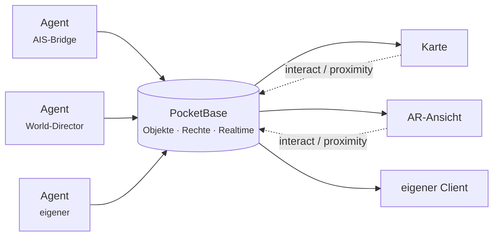

# Ajna

Ajna legt eine dauerhafte, gemeinsame Ebene über die reale Welt. Objekte haben echte Koordinaten, liegen dort für alle Berechtigten gleichzeitig und bleiben liegen, wenn niemand hinschaut. Man sieht sie auf einer Karte oder — am selben Ort stehend — in AR durch die Kamera.

Es ist kein Spiel mit fester Regelwelt, sondern der Unterbau dafür: Objekte, Rechte, Echtzeit-Verteilung und Programme, die die Welt bevölkern.

---

## Wohin willst du?

| | |
|---|---|
| 🧭 **Ajna benutzen** | Du willst die App auf einem Server nutzen, den jemand anders betreibt. → [Erste Schritte](Erste-Schritte.md) · [Die App](Die-App.md) · [Privatsphäre](Privatsphaere.md) |
| 🖥 **Eigenen Server betreiben** | Du willst eine eigene Ajna-Instanz aufsetzen. → [Server betreiben](Server-betreiben.md) · [Agents betreiben](Agents-betreiben.md) · [Berechtigungen](Berechtigungen.md) |
| 🛠 **Dafür entwickeln** | Du willst einen Agent oder einen eigenen Client bauen. → [Einen Agent bauen](Einen-Agent-bauen.md) · [Ajna-Library](Ajna-Library.md) · [Agent-Library](Agent-Library.md) · [Objektmodell](Objektmodell.md) · [Architektur](Architektur.md) |

---

## In drei Sätzen

Ein **Objekt** ist ein Datensatz mit Koordinaten, Rechten und einem freien `state`-Feld. Ein **Agent** ist ein ganz normaler angemeldeter Client, der Objekte anlegt und pflegt — Schiffe aus AIS-Daten, WLAN-Netze, Wildtiere, Figuren, Smart-Home-Geräte. Der **Viewer** (Karte oder AR) zeichnet, was er sehen darf, und schickt Interaktionen zurück.

Daraus folgt die wichtigste Regel des Systems: **Agents liefern Daten, niemals Code.** Wie ein Objekt aussieht, beschreibt ein deklaratives `appearance`-JSON — der Client entscheidet, was er daraus macht. Siehe [Objektmodell](Objektmodell.md).

---

## Was es (noch) nicht ist

Ehrlichkeit spart Enttäuschung:

- **Kein fertiges Spiel.** Es gibt Aufträge, Inventar und Interaktionen, aber keine Kampagne und keine Balance.
- **Positionsangaben sind nicht beweisbar.** Der Client ist die einzige Positionsquelle und kann lügen. Für Belebung reicht das, für „war nachweislich dort" nicht — dafür braucht es einen zweiten Faktor (UWB-Anker, signierter Sensor-Report). Siehe [Privatsphäre](Privatsphaere.md).
- **Federation ist einseitig.** Ein Client kann sich mit mehreren Servern gleichzeitig verbinden und sieht deren Inhalte nebeneinander; die Server selbst reden nicht miteinander.

---

## Tiefer gehende Einzelthemen

Spezialgebiete mit eigener Hardware oder eigenem Aufbau liegen weiterhin unter [`docs/`](https://github.com/blckwngd/Ajna/tree/main/docs):

| Thema | Dokument |
|---|---|
| Zentimeter-Positionierung per UWB | `docs/uwb.md` |
| Zeigegerät („Zauberstab") | `docs/pointing.md`, `docs/wand-slice.md` |
| Home Assistant anbinden | `docs/homeassistant.md` |
| Visuelles Tracking / SLAM-Vorstudie | `docs/visual-tracking.md` |
| Fernbedienung realer Geräte | `docs/realworld-remote.md` |
| Betrieb auf einem Server | `docs/deployment.md` |
