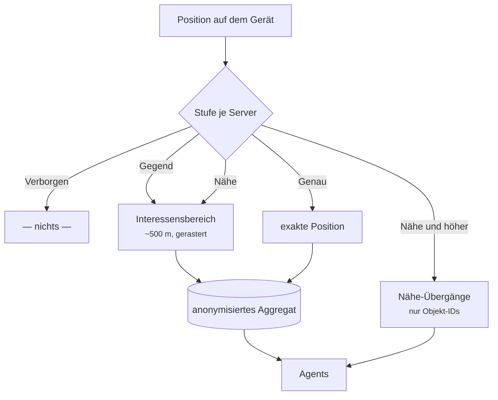

# Privatsphäre

Ajna ist ortsbezogen — ohne Standort funktioniert nichts. Deshalb ist genau geregelt, **was das Gerät verlässt** und **wer es erfährt**.

## Vier Stufen, pro Server

Die Standort-Freigabe wird **je Server** eingestellt, nicht global. Man vertraut Servern unterschiedlich; ein globaler Wert wäre entweder der kleinste gemeinsame Nenner oder ein Leck zum unvertrauenswürdigsten Server.

| Stufe | Was der Server erfährt |
|---|---|
| **Verborgen** *(Voreinstellung für neue Server)* | Nichts. Agents wissen nicht, dass du da bist. |
| **Gegend** | Ein unscharfer Bereich von ~500 m, auf ein Raster gerundet. Agents bevölkern die Gegend um dich. |
| **Nähe** | Zusätzlich erfahren Agents in deiner Nähe, dass jemand bei ihnen ist — über die **Objekt-ID**, nie über Koordinaten. Das ermöglicht Näherungs-Auslöser. Der Server kann deine Position dadurch enger eingrenzen als bei „Gegend". |
| **Genau** | Der Server erhält deine exakte Position. Agents sehen weiterhin nur das grobe Aggregat — den Genauigkeitsgewinn hat der Server selbst. Nur für Server, denen du wirklich vertraust. |

Die Einstellung liegt **gerätelokal**, mit Absicht: die Regel, die einen Server begrenzt, gehört nicht auf diesen Server. Und das Telefon im Feld darf eine andere Stufe verdienen als der Rechner zu Hause — die fehlende Geräte-Synchronisation ist hier ein Feature.

## Was konkret übertragen wird

**Interessensbereich.** Ab „Gegend" veröffentlicht der Client ein grobes Rechteck. Der Server führt daraus ein anonymisiertes Aggregat; Agents fragen nur dieses ab und erfahren nie, von wem ein Bereich stammt. Deshalb bevölkern Agents die Gegend, ohne dich zu kennen.

**Nähe.** Ab Stufe „Nähe" meldet der Client Übergänge — „ich bin bei Objekt X angekommen", „ich habe X verlassen". Übertragen werden ausschließlich **Objekt-IDs**, niemals Koordinaten: der Client kennt seine Position, rechnet den Umkreis selbst aus und schickt nur die Übergänge. Gemeldet wird nur für Objekte, die du **sehen** darfst — ein unsichtbares Objekt spürt dich nicht.

Eine Feinheit mit Absicht: Die Stufe begrenzt nur `enter`, nie `leave`. „Ich bin da" verrät etwas, „ich bin weg" nimmt etwas zurück. Würde man beides gleich behandeln, bliebe beim Herunterstufen die letzte Anwesenheit ewig stehen — die Sperre bewirkte das Gegenteil dessen, wofür man sie gesetzt hat.

**Durchgesetzt** wird die Stufe an einer einzigen Stelle, im Fan-out des `AjnaManager`. Läge die Prüfung bei den Aufrufern, wäre der nächste vergessene Aufruf ein Leck.

## Grenzen — bitte lesen

**Positionsangaben sind nicht beweisbar.** Der Client ist die einzige Positionsquelle und kann Nähe behaupten. Für Belebung ist das ideal, für „Spieler war nachweislich an Ort X" (etwa als Auftragsbedingung) ungeeignet. Dafür braucht es einen zweiten Faktor — einen UWB-Anker oder einen signierten Sensor-Report.

**Ein `leave` kann ausbleiben** (App beendet, Netz weg). Wer einen sauberen Zustand braucht, sollte Anwesenheit nach einer Weile selbst verfallen lassen.

**Namen sind öffentlich.** Das Feld `name` eines Objekts sieht jeder, der das Objekt sehen darf. Dort gehören **keine Klarnamen** hinein. Anwendungen, die Personendaten führen, legen sie in ihre eigenen Felder mit engeren Rechten.

## Was der Betreiber sieht

Ein Server-Betreiber hat Zugriff auf seine Datenbank — also auf alles, was du diesem Server geschickt hast. Die Stufen regeln, *wie viel das ist*, nicht, was er damit tut. Bei „Genau" liegt deine exakte Position dort. Das ist der Grund, warum die Voreinstellung für neue Server „Verborgen" ist.
