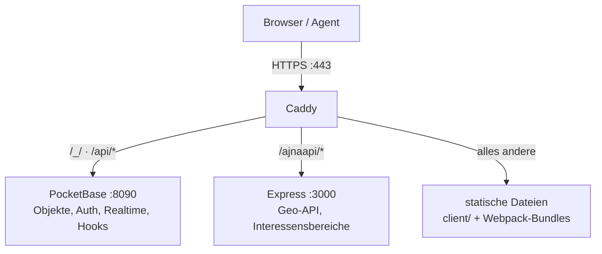

# Server betreiben

<!-- nav -->
[← Inhalt](Home.md#inhalt) · Betreiben: **Server betreiben** · [Agents betreiben](Agents-betreiben.md) · [Berechtigungen](Berechtigungen.md)
<!-- /nav -->

<!-- seiteninhalt -->
**Auf dieser Seite:** [Voraussetzungen](#voraussetzungen) · [Einrichten](#einrichten) · [Starten](#starten) · [Erste Konfiguration](#erste-konfiguration) · [Umgebungsvariablen](#umgebungsvariablen) · [Dauerbetrieb](#dauerbetrieb) · [Sichern](#sichern) · [Mehrere Anwendungen auf einer Instanz](#mehrere-anwendungen-auf-einer-instanz)
<!-- /seiteninhalt -->

Eine eigene Ajna-Instanz besteht aus vier Prozessen hinter einem gemeinsamen HTTPS-Eingang.



Warum Caddy davor: PocketBase, Express und die Client-Dateien liegen damit auf **einem Origin**. Kein Mixed-Content, ein Cookie- und Storage-Bereich, und der Client kann `window.location.origin` als Serveradresse nehmen. In Produktion lauscht PocketBase bewusst nur auf Loopback — Caddy ist die einzige öffentliche Schnittstelle.

## Voraussetzungen

| Werkzeug | Installation |
|---|---|
| Node.js 22+ | [nodejs.org](https://nodejs.org/) — 22+ bringt `fetch` und `EventSource` mit |
| PocketBase-Binary | nach `pocketbase/pocketbase` bzw. `pocketbase/pocketbase.exe` — [pocketbase.io](https://pocketbase.io/docs/) |
| Caddy auf dem `PATH` | `winget install CaddyServer.Caddy` · `brew install caddy` · [caddyserver.com](https://caddyserver.com/download) |

## Einrichten

```bash
git clone https://github.com/blckwngd/Ajna.git
cd Ajna
npm install
cp Caddyfile Caddyfile.prod     # lokale Anpassungen kommen hier hinein
```

`Caddyfile` ist die eingecheckte Vorlage, `Caddyfile.prod` die gitignorierte Arbeitsdatei. **Für rein lokales Testen genügt die Kopie unverändert** — der `localhost`-Block funktioniert sofort mit Caddys interner Zertifizierungsstelle.

Für einen öffentlichen Server im `Caddyfile.prod` anpassen: Domain, E-Mail-Adresse für Let's Encrypt und der Pfad zu den Client-Dateien. Den `demo.example.com`-Block auskommentieren, wenn er noch nicht gebraucht wird — sonst versucht Caddy bei jedem Start, ein öffentliches Zertifikat zu ziehen.

## Starten

```bash
npm run stack
```

Startet PocketBase, den Webpack-Watcher, Express und Caddy gemeinsam. Beim allerersten Start installiert Caddy seine interne Zertifizierungsstelle ins System (Administrator-Abfrage); danach vertraut der Browser `https://localhost` ohne Warnung.

Einzeln geht auch:

| Befehl | Prozess |
|---|---|
| `npm run pocketbase` | PocketBase auf `0.0.0.0:8090` |
| `npm run dev` | Webpack im Watch-Modus |
| `npm run start` | Express auf Port 3000 |
| `npm run caddy` | nur Caddy mit `Caddyfile.prod` |
| `npm run build` | einmaliger Webpack-Build |
| `npm run stack:all` | Stack **plus** die Agents POI, AIS, WiGLE und World-Director |

### Erreichbar unter

| URL | Zweck |
|---|---|
| `https://localhost/` | Haupt-Client (Karte / AR / Objekte / Einstellungen) |
| `https://localhost/index-map.html` | nur Karte, mit Desktop-Editor |
| `https://localhost/index-ar.html` | nur 3D/AR |
| `https://localhost/_/` | PocketBase-Administration |
| `https://localhost/api/*` | PocketBase-REST, Realtime und Hooks |
| `https://localhost/ajnaapi/*` | Express-Backend |

Das Zertifikat deckt zusätzlich `ajna.localhost` und den Rechnernamen ab — ein Telefon im selben Netz erreicht die Instanz also unter `https://<rechnername>/`. Damit Chrome dort nicht warnt, muss die interne Zertifizierungsstelle einmalig aufs Gerät: `npm run android:trust-caddy`.

## Erste Konfiguration

**1. Administrator anlegen.** `https://localhost/_/` öffnen, PocketBase führt durch die Ersteinrichtung.

**2. Benutzer anlegen.** In der `users`-Collection. Eine offene Selbstregistrierung ist nicht vorgesehen — Konten legt der Betreiber an.

**3. Standard-Rechte setzen.** Damit angelegte Objekte für andere sichtbar sind, braucht der Benutzer `default_permissions`, z. B.:

```json
[{ "subject_type": "authenticated", "rights": ["view"] }]
```

Ohne das sieht nur der Eigentümer selbst, was er anlegt. Mehr dazu unter [Berechtigungen](Berechtigungen.md).

**4. Prüfen.** Die Berechtigungskette lässt sich end-to-end testen:

```bash
node tools/acl-selftest.mjs
```

## Umgebungsvariablen

Werte kommen geschichtet: Prozess-Umgebung → `agents/.env.<name>` → `.env` im Wurzelverzeichnis.

| Variable | Wirkung |
|---|---|
| `AJNA_URL` | Adresse der Instanz für Agents und Werkzeuge (Vorgabe `http://127.0.0.1:8090`) |
| `AJNA_PB_URL` | PocketBase-Adresse für den Express-Server |
| `AJNA_USER`, `AJNA_PASS` | Zugangsdaten des Agenten-Kontos |
| `AJNA_GEO_OVERPASS` | Overpass-Endpunkt der Geo-API |

Ist `AJNA_URL` eine HTTPS-Adresse mit Caddys interner Zertifizierungsstelle, starten Agents sich selbsttätig einmal mit `--use-system-ca` neu, damit Node die Zertifikatskette anerkennt.

## Dauerbetrieb

`ecosystem.config.cjs` beschreibt PocketBase, Express und die Client-Auslieferung für **pm2**:

```bash
npm i -g pm2
pm2 start ecosystem.config.cjs
pm2 save
```

Agents registriert man einzeln dazu, siehe [Agents betreiben](Agents-betreiben.md). Für Reverse-Proxy und TLS bleibt Caddy zuständig — Details und Systemd-Varianten in [`docs/deployment.md`](https://github.com/blckwngd/Ajna/blob/main/docs/deployment.md).

## Sichern

Alles Zustandsbehaftete liegt in `pocketbase/pb_data/`. Das Verzeichnis sichern heißt die Instanz sichern. PocketBase bringt in der Administration eine eigene Backup-Funktion mit.

## Mehrere Anwendungen auf einer Instanz

Eine Instanz kann mehrere unabhängige Anwendungen tragen. Trennung läuft über `type` und `state.source` der Objekte plus die Rechte — nicht über getrennte Datenbanken. Agents räumen nur auf, was ihre eigene `state.source` trägt, und Clients filtern entsprechend.

<!-- navfuss -->
---

← [Privatsphäre](Privatsphaere.md) · [Inhalt](Home.md#inhalt) · [Agents betreiben](Agents-betreiben.md) →
<!-- /navfuss -->
